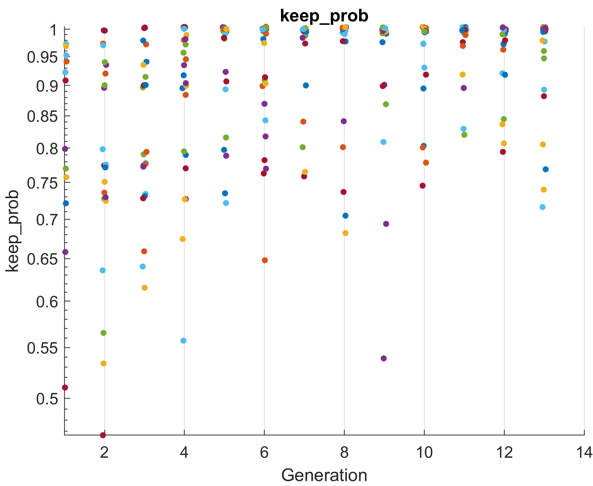
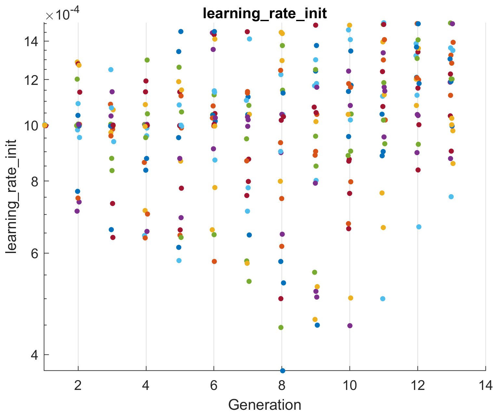
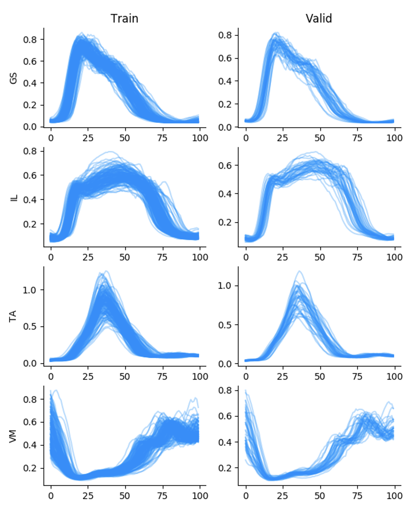
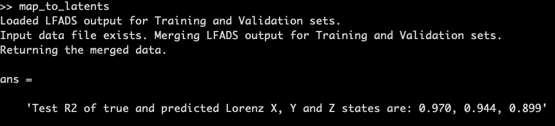
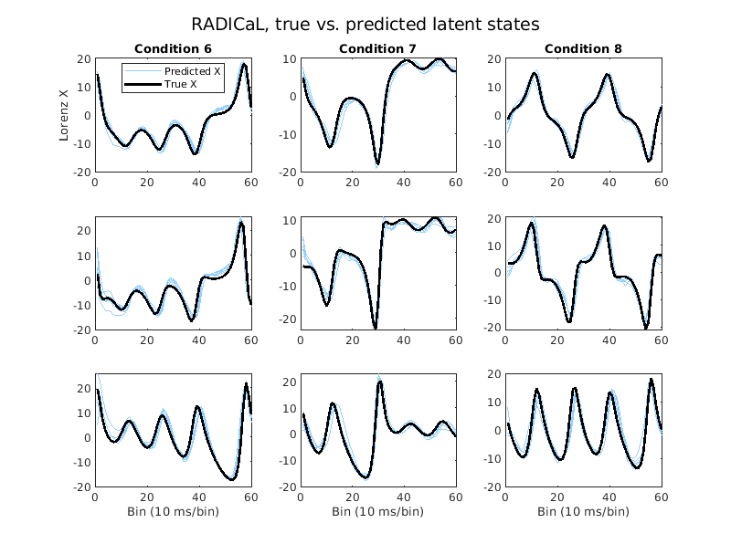

##Overview
!!! info
    Estimated time for section: **30 min**

The following section details downloading the results from Google Cloud, and then running several analysis scripts.

##Downloading Data From GCP
Once LFADS w/ PBT has finished running, we can now download the data back to our local computer for analysis.

!!! warning
    At this point, you can stop all your machines (server and clients). Information on stopping machines can be found [here](https://snel-repo.github.io/autolfads/setupAddInfo/#stopping-starting-vms) 

To download data from the bucket, navigate back to [https://console.cloud.google.com/storage](https://console.cloud.google.com/storage).

Click on the newly created zip file, and then click 'Download.' The output of the run should now be downloaded to your local computer.

##Post Processing 
Now that you have downloaded the data back to your local computer, open up the tutorial package ([download here](files/tutorial_package.zip))

Open up `pbt_plot.m` in Matlab. First, set the tutorial_package to your current working folder. 

Then, inside the `pbt_plot.m` script, we need to set the `data_folder` variable to the location of your `pbt_run` folder, which is located inside the `run` folder you downloaded. For instance, on my computer its `C:\\Users\tutorial\output\runs\pbt_run`.

Set the `output_folder` variable to the folder where you want the plots generated. 

Run the `pbt_plot.m` script. This script will show the evolution of HPs over successive generations. These are some of the plots we got from the tutorial run. 

## Application-specific analyses

###Spiking dataset: compare to true rates

!!! note
    This section is only for users using a synthetic spiking dataset (as in the tutorial_package) where ground truth firing rates are available. 

If you used the synthetic dataset derived from Lorenz, then we can compare to the true rates.

First, open the `spikes/compare_rates.m` script in the tutorial package. Fill in the first `lfads_output_dir` with the address of the `lfads_output` which is located inside your `run` folder. For instance, on my computer its `C:\\Users\tutorial\output\runs\lfads_output`.

Then, you can run the script, which will generate R^2 value, which represents the error in the inferred rates compared to the true rates, as well as plot the inferred rates of several example neurons against their true underlying rates.

The following plot was generated from this tutorial's run.

###EMG dataset:

!!! note
    This section is only for the specific EMG dataset in the tutorial_package 

If you used the locomotion EMG dataset provided in the tutorial package, then we can visualize the output of the AutoLFADS model and also perform a joint angular acceleration decoding analysis similar to what is presented in Wimalasena et al., 2021. 

First, open the `emg/emg_post_analysis.py` script in the tutorial package. 
- Change the `data_dir` with the address of the `lfads_input` which is located in your `run` folder 
- Change the `lfads_output_dir` with the address of the `lfads_output` (also in `run`)
For instance, on my computer its `C:\\Users\tutorial\output\runs\lfads_output`.

Then you can run the script. AutoLFADS inferred means from the training and validation set used for training will be plotted for 4 example EMG channels. Additionally, an optimal linear estimator will be fit to map the AutoLFADS output onto joint angular accelerations of the hip, knee, and ankle. Cross-validated R^2 calues are included in the title of each subplot. 

The following plots will be generated from this script in the tutorial. 

###Calcium dataset: map to true latent states

!!! note
    This section is only for users using a synthetic calcium dataset (as in the tutorial_package) where ground truth latent states are available. 

If you used the synthetic calcium dataset derived from Lorenz, then we can measure how well RADICaL predicts the true latent states.

First, open the `calcium/map_to_latents.m` script in the tutorial package. Fill in the first `lfads_output_dir` with the address of the `lfads_output` which is located inside your `run` folder. For instance, on my computer its `C:\\Users\tutorial\output\runs\lfads_output`.

Then, you can run the script. RADICaL inferred rates are mapped to the ground truth lorenz states by training a ridge regression. The script will then generate R^2 (coefficient of determination) value, which represents how well the predicted latent states match to the true latent states for the testing trials, as well as plot the predicted latent states of several example conditions against their ground truth latent states.

The following plot was generated from this tutorial's run.

 
