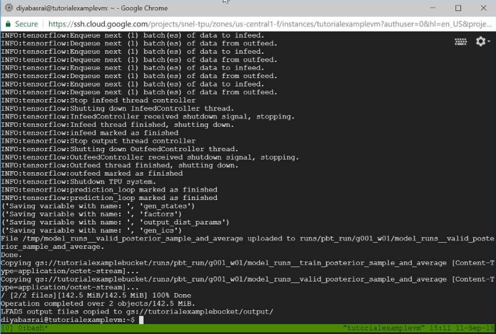

##Checking Run
To confirm that LFADS w/ PBT is training, your tmux window should display some stage of the PBT process, either assigning workers or waiting for workers to finish training.

 

###Approximate Time
For the sample Lorenz data, the entire process with 2 TPUs should take ~15 minutes. However, this is a small dataset -- larger datasets can take much longer, from hours to days.... (TO DO, give more concrete approximations)

###Stopping Run Early
If you want to stop your run early, in your tmux window you can press ```^c``` (ctrl-c) and then kill your [tmux](tmux/#tmux) session. However, if a run is killed, you might not be able to start a run with th same VM (TO DO: find out if a run is killed, whether it can just be promptly restarted or new VM has to be created)_

###Finished Run
When training is finished, your tmux window should display the following. 


At this point, you're inferred rates is now located in the 'output' folder of your bucket. However, before we download the rates back to our local computer and begin analysis, we need to delete the VMs and TPUs as to not incur more costs.

!!! warning
    Don't forget to delete your VMs and TPUs if you finished an LFADS w/ PBT run.

###Deleting VMs and TPUs
To delete the server VMs and TPU, we can use the following command in the `Cloud Shell` (located in the upper right corner of the compute engine), and in the command replace SERVER_NAME, ZONE, NUM_TPUS with parameters set in the set-up script.

    curl -s https://raw.githubusercontent.com/snel-repo/test-repo/master/server-manager.sh | bash /dev/stdin delete <server-name> <zone> <num-tpu>

This removes VMs and TPUs (as to not incur more charges once run is finished.)  

From here, we can now move on to the analysis section to download our data back from the cloud and process it. 
