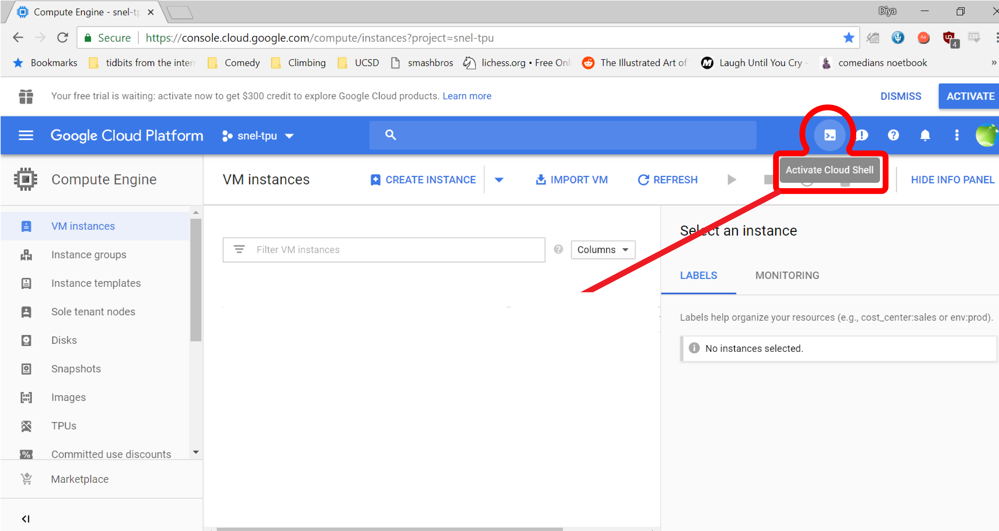

##Overview
!!! info
    Estimated time for section: **45 minutes**

The following section details how to set-up cloud infrastructure on GCP. 

**These steps need to be completed once per PROJECT.** 

1. Set-up virtual machines
2. Set-up storage infrastructure

**This step needs to be completed once per USER.** That is, if a team is working on a project, each individual member with a Google Account has to execute the steps listed below.

1. Set-up user

##Tutorial package
This tutorial has a package that contains several scripts and a synthetic dataset useful for this tutorial. Note that depending on your specific needs, not every file in this package needs to be used.

Download the tutorial package [here](files/tutorial_package.zip).

## Create and configure the google cloud project
This first step creates your project in Google Cloud Platform. This step only needs to be done once.

Go to [https://cloud.google.com/](https://cloud.google.com/) and sign in with an account associated with your institution or university. Note that if you just sign in with your personal Google account, there is a chance that an eventual request for GPU quota will be denied, so it is highly suggested attempting to sign in with an institutional email address.

If this is your first time logging into Google Cloud Platform, first we need to create a project. Navigate to the [console.cloud.google.com/compute](https://console.cloud.google.com/compute) and then fill out the details needed to create a project.

Next, you have to link your account to a billing account by entering a credit card. Navigate back to the dashboard at [console.cloud.google.com/home](https://console.cloud.google.com/home) and then click 'Billing,' located on the right side. Here you can add a method to pay for GPUs.

##Requesting additional GPU quota
Compute Engine enforces quota to prevent unforseen spikes in GPU usage. The quota enforces an upper bound on how many GPUs can be created in each zone. Thus, you must make sure your quota allows you to have enough GPUs to run your client machines, and if not, request additional quota. Google may take up to 48 hours to allocate quota (although generally much faster than this), so it is recommended to request additional quota well before planning to begin a run.

Generally, we need to increase our quota of 1) # of GPUs, 2) # of global GPUs, and 3) # of global CPUs.

In order to request quota, navigate to [https://console.cloud.google.com/iam-admin/quotas](https://console.cloud.google.com/iam-admin/quotas), open up the 'Metric' drop down menu, de-select all by clicking 'none.' 

First, scroll down to find an appropriate GPU that you will be attaching to your virtual machines. The user can choose any GPU that suits their purpose; the default one used in this tutorial is NVIDIA K80 GPU. Note, the selected GPU works well as 'normal' type, not 'committed' (higher costs) or 'preemptible' (short-lived VMs). 

Select the chosen GPU, and then scroll down to the specific region you want to increase quota in. Once you select it, click the 'Edit Quotas,' and fill in the information.

To follow this tutorial exactly, you need at least 4 NVIDA K80 GPUs in us-central1-c, and 4 NVIDIA K80 GPUs in us-east1-c.

<video width="100%" height="auto" controls loop>
  <source src="../media/autoLFADS/quota.mp4" type="video/mp4">
</video>
 
Next, we want to increase the number of global GPUs. You can deselect all `metrics` again, and then find `GPUs (all regions)`. To follow this tutorial exactly, click `edit quota` and increase this to 8 (or greater). On certain GCP accounts, this global GPU metric may not show up and if so, this specific quota can be ignored. 

Finally, we want to increase the number of global CPUs. You can deselect all `metrics` again, and then find `CPUs (all regions)`. To follow this tutorial exactly, click `edit quota` and increase this to 64 (or greater). On certain GCP accounts, this global CPU metric may not show up and if so, this specific quota can be ignored. 
 

## Creating Server VM 

Once the project is created, we must create a server VM. To do so, first navigate back to the compute engine at [console.cloud.google.com/compute](https://console.cloud.google.com/compute). Then, we want to open the cloud shell by clicking the 'Activate Cloud Shell' button in the top right. 

   
Inside the shell of the gcloud project, we want to clone the SNEL repository. This has the collection of scripts which we will be using to create and set-up the server and client VMs and also to start PBT.

For original AutoLFADS modeling spiking activity:
   
    git clone -b GCP https://github.com/snel-repo/autolfads.git

For extensions of AutoLFADS modeling EMG and calcium (i.e., RADICaL) signals:
    git clone -b GCP-extension https://github.com/snel-repo/autolfads.git

   
Now, we want to navigate to the gcloud_scripts directory inside this repository. We can type the following command into our cloud shell to navigate to this directory. 
   
    cd autolfads/gcloud_scripts 

Next, we want to run the server_set_up.sh script, which has the following format: 

`sh server_set_up.sh <server_name> <zone>`

Server_name is the name of the server we create, and can be any lowercase alphanumeric characters. Zone is the region where your server is stored and used; best is usually the zone closest to you (list of zones can be found here: [https://cloud.google.com/compute/docs/regions-zones/#available](https://cloud.google.com/compute/docs/regions-zones/#available))
 
In this tutorial, we'll create a server named 'tutserver' and in the zone 'us-central1-c'. We will thus execute the following command in the cloud shell.

    sh server_set_up.sh tutserver us-central1-c

This step will take a couple minutes to run. You will know its complete when a server is seen in list of VMs and the compute engine shows the following.

!!! warning
    Active VMs can rack up costs when left unattended. Remember to shut them down when not in use. For information on how to stop, pause, and start VMs, go to this [section](../setupAddInfo/#stopping-starting-vms).

###Create Server VM Walkthrough
<video width="100%" height="auto" controls loop>
  <source src="../media/autoLFADS/server_setup.mp4" type="video/mp4">
</video>

If for some reason the server VM doesn't seem to have been correctly created, check the [common errors](../common_errors) section for debugging help.

## Create the client machines 

After creating the server machines, we next want to create the client machines. To do so, first make sure you have the cloud shell still opened and inside the directory `autolfads/gcloud_scripts`.

To create the client machines, we want to pass in parameters into the following command: 

`sh machine_setup.sh <client_name> <number_of_clients> <zone> <name_of_GPU>`

Client name is any lowercase alphanumeric characters naming the client, number_of_clients is how many client machines are created, and zone is the location the clients will be stored in.

 In order to decide how many clients to be created for your specific dataset, refer to [additional information](../setupAddInfo/#choosing-number-of-clients). Remember that the number of client machines is limited by your GPU quota in a particular zone, that is, your max number of GPUs in a zone is the max number of client machines you can create there .

The argument <name_of_gpu> only needs to be passed in if you are using a GPU that is not the default NVIDIA K80 GPU, and is the full name of the GPU without in lowercase with spaces replaced with dashes (for instance, `nvidia-tesla-v100`).  

In this tutorial, we will create 8 clients dispersed over two zones, as not to not exceed quota limits. Since we are using the NVIDIA K80 GPU we omit the `<name_of_GPU>` argument. To create these client machines in two zones, we run the following two lines of code consecutively. 

    sh machine_setup.sh tutclientc 4 us-central1-c

Once control of cloud shell is returned back:

    sh machine_setup.sh tutcliente 4 us-east1-c

###Create the client machines walkthrough
<video width="100%" height="auto" controls loop>
  <source src="../media/autoLFADS/machine_setup.mp4" type="video/mp4">
</video>

##Check if Docker is successfully installed

Creating the clinet machines will take several minutes to run, and then an additional 10 or so minutes for the client machines to finish pulling the Docker image. Note that the creation of the client machines being finished is NOT indicated by control of Cloud Shell being returned or by there simply being a green checkmark next to the VMs; you must wait until the Docker image has been pulled on each machine.
 
In order to see if the client machines have finished pulling the Docker image, run the following command in cloud shell.

	sh check.sh pbtclient

!!! note 
    `pbtclient` is the tagname, that is, a shorthand name for all client VMs in all zones. Commands that involve all client VMs at the same time, such as in the AutoLFADS python script and in check.sh, use `pbtclient` as the common client name. 

If the client machines are completely finished installing, then every client machine should return a `Docker Installed on <client_name>`

Once all the machines have Docker properly installed, this marks the end of creating necessary VMs. 
    
<video width="100%" height="auto" controls loop>
  <source src="../media/autoLFADS/check.mp4" type="video/mp4">
</video>
