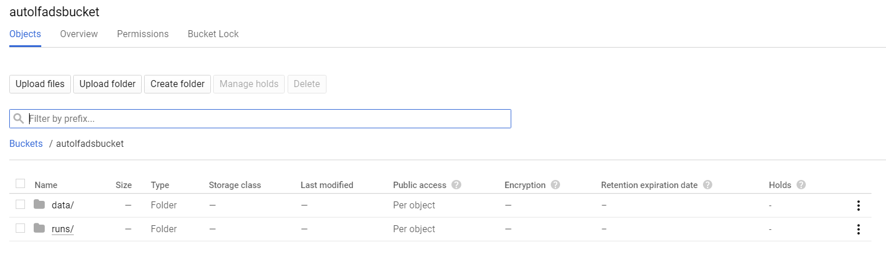

##Overview
!!! info
    Estimated time for section: **2 hours**

This section details the steps for connecting your dataset to AutoLFADS or RADICaL and then beginning a run.

The following steps have to be done everytime you want to begin an AutoLFADS or RADICaL run with a new dataset. If you already have data uploaded to the bucket, and you have already linked your [run parameters](../run_params), then you can proceed straight to the [run model](../run_autoLFADS) section.

At this point in the tutorial, you have already set up your [cloud infrastructure](../create_infra). If you would like to add additional client machines, the way to do this is explained in [add additional client machines](../runAddInfo/#Add-Additional-Client-Machines) section in the 'Additional Information' section. 

Note, if you are re-using client machines you have created some time ago, there is a chance you might have to update your Docker image on all client machines. Instructions for doing so are in the [update Docker image](../runAddInfo/#Updating-docker-image) section. 

##Setting up your data

###Sample datasets
This tutorial includes three sample datasets, a synthetic spiking dataset and a real EMG dataset to demonstrate AutoLFADS, and a synthetic 2-photon calcium imaging dataset to demonstrate RADICaL.

#### Synthetic spiking dataset
This sample synthetic dataset is derived from a Lorenz system that can be used to set-up an AutoLFADS run. This synthetic dataset is ideal to test out AutoLFADS as it is intrinsically low-D, and the inferred rates generated by AutoLFADS can easily be compared to its true rates to give a sense of the effectiveness of AutoLFADS.

#### Real EMG dataset
Coming soon

#### Synthetic 2-photon calcium imaging dataset
This sample dataset contains simulated deconvolved calcium events and is designed to test out RADICaL. Similar to the sample spiking dataset, spike trains are generated by simulating a population of neurons whose firing rates are linked to the state of a Lorenz system. Realistic flurorescence traces are generated from the spike trains and deconvolved to extract calcium events. Importantly, the sampling times for different neurons are staggered to simulate 2p laser scanning sampling times. RADICaL takes in the deconvolved calcium events and outputs inferred event rates. The inferred event rates can then be mapped to the ground truth Lorenz states to give a sense of how effective RADICaL recovers the latent states.

The synthetic datasets are located in the tutorial package, called `lfads_data.h5`, `lfads_emg_data.h5` and `lfads_cal_data.h5`. If you have not downloaded it yet, you can [download it here](files/tutorial_package.zip).

If you would like to use these datasets, you can skip the next section on using your own data, and proceed straight to the 'Uploading data' section in this page.

###Using your own neural population data
If you would like to use your own neuronal population data, the data must be a `.mat` file with a `.data` attribute which contains spiking data in the format `neurons x trial-length x number of trials`. Furthermore, we suggest using data with a sequence length less than 100 timesteps; while there is not a clear data size limit, larger datasets are more prone to failure when running the python script. Once you have your data in a `.mat` file, you can use the `convert_h5.m` in the script [zip file](files/tutorial_package.zip) to convert it to the necessary `.h5` file format in order to upload it to Google Cloud Platform. 

Simply open up the script, point the `data` field toward your .mat file and edit the `lfads_input_file` to point toward where you want the .h5 file to be generated. Optionally, you can also edit the `valid_set_ratio` variable to use a different amount of the data for validation. Once you have set these variables, you can run the script and it should output the converted .h5 file.  

##Uploading Data

Next, navigate back to [console.cloud.google.com/storage](https://console.cloud.google.com/storage), click on the bucket you [created](../create_bucket), and then navigate to your "data" folder. Then, upload your .h5 file here either by clicking upload file or by dragging and dropping. The .h5 file must be renamed to have the prefix specified by the `data_file_namestem` parameter in the `pbt_script_multiVM.py` file located in `autolfads/pbt_opt` directory of the SNEL repo. The default prefix is `lfads`, thus, in this tutorial we'll upload our data named lfads_data.h5 (or lfads_emg_data.h5 or lfads_cal_data.h5).

Our data folder in our bucket should now look like this with the data uploaded.

   

<video width="100%" height="auto" controls loop>
  <source src="../media/autoLFADS/upload_data.mp4" type="video/mp4">
</video> 
