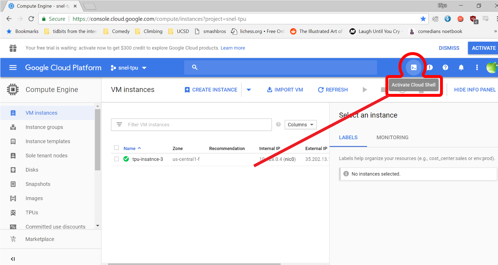

##Overview
Once, we have prepared our data, we now need to run some set-up scripts creating necessary VMs and TPU instances, and then run a python script that begins training. All these will take place on the [Google Cloud Platform](https://console.cloud.google.com).

##Running Set-up Script
First, navigate to the Google Cloud Compute Engine, located at [https://console.cloud.google.com/compute](https://console.cloud.google.com/compute). Then, click 'Activate Cloud Shell,' located in the toolbar to the right of the search. 



This should open up a black-background 'Cloud Shell' at the bottom of your Google Cloud Platform console. 

If this is the first you are using GCP, you can move on to the next [section](/runLFADS/#create-buckettpusvms).
However, if you have mlutiple Google Cloud projects, use the following line of code in the 'Cloud Shell' to set it to your project.

    gcloud config set project <your-project>

Replace <your-project> with the name of your project (omit < >)
###Create Bucket/TPUs/VMs <a href="https://cpandar.github.io/lfads-pbt/runLFADS/#set-up-script-walkthrough"></a> 

Next, we will use a command that creates a bucket to hold the data, VMs for server and clients, and TPU instances. First, we want to add parameters to the following line of code.

    curl -s https://raw.githubusercontent.com/snel-repo/test-repo/master/create-vms.sh | bash /dev/stdin <server-name> <num-tpu> <bucket-name> <zone>

* ```<server-name>``` is the user's choice for the name of the VM server that is created. The server name can only be lower case, alphanumeric characters (so avoid underscores and other special characters.) The server name also has to be unique to the project (you can go to [https://console.cloud.google.com/compute](https://console.cloud.google.com/compute) to check current server VM instances).  
* ```<num-tpu>``` refers to how many TPU instances will be created for the run. 
* ```<bucket-name>``` is the user's choice for the name of the bucket that is created. The bucket name can only be lower case, alphanumeric characters (so avoid capital letters, underscores and other special characters.) The bucket must also be unique, (you can go to [https://console.cloud.google.com/storage](https://console.cloud.google.com/storage) to check current buckets)
* ```<zone>``` is a parameter that points towards the zone closest to the user. A list of available zones and their names is located [here](https://cloud.google.com/tpu/docs/regions).

Modify the following parameters (remove < > characters), separating each by a single space. 

For example, this is the line of code with parameters passed in.

    curl -s https://raw.githubusercontent.com/snel-repo/test-repo/master/create-vms.sh | bash /dev/stdin tutorialexamplevm 2 tutorialexamplebucket us-central1-f

Then, copy and paste the command into the 'cloud shell' at the bottom of the Google Cloud Compute Engine, and then hit ```enter```.

The code will likely take several minutes to run. While the code is running, it should create a bucket to hold data, TPU instances corresponding to how many you chose, and a server VM under the name you chose.

The code is finished running when you see your final TPU created, as in the image below.


Once you see this, hit ```enter``` one more time. This should return control of the 'Cloud Shell.'
 
#### Set-up Script Walkthrough
<video width="100%" height="auto" controls muted loop>
  <source src="../media/setupscriptgyfupdate.mp4" type="video/mp4">
</video>

##Upload Data to Bucket <a href="https://cpandar.github.io/lfads-pbt/runLFADS/#upload-walkthrough"></a>
Next, we want to upload our created .h5 file to our newly created bucket.

First, navigate to the Cloud Storage section of GCP, located at [https://console.cloud.google.com/storage](https://console.cloud.google.com/storage)

Then, find the bucket you created in the browser section. Click on it, and then click on your 'data' directory.

Drag your created .h5 file into that directory to upload it. 

####Upload Walkthrough
<video width="100%" height="auto" controls muted autoplay loop>
  <source src="../media/uploaddatetobucketupdate.mp4" type="video/mp4">
</video>

##Start LFADS w/ PBT Run <a href="https://cpandar.github.io/lfads-pbt/runLFADS/#run-script-walkthrough"></a>
 
In your VM instances tab, find your VM-Server instance. Click on the button to the right of it labeled 'SSH' (you might have to scroll to the right) and then click 'Open in browser window.' 

<video width="100%" height="auto" controls muted autoplay loop>
  <source src="../media/browserwindowupdate.mp4" type="video/mp4">
</video>

Then, copy the pbt_script_1VM.py script to your home directory with the following command.

    cp /code/PBT_HP_opt/pbt_opt/pbt_script_1VM.py ~

Navigate to your home directory:

    cd ~

Once copied, we want to make some changes to the pbt_script_run_manager.py file such as editing parameters and setting paths. You can use whatever editor you would like, but in this tutorial we'll use nano.  

    nano pbt_script_1VM.py 

Here, we want lines 21-24 to point towards the bucket we created.

    run_save_path = 'gs://pbt-test-bucket-2/runs/'      # where PBT will store the runs
    output_folder = 'gs://pbt-test-bucket-2/output/'    # where final PBT-LFADS output will be saved
    data_dir = 'gs://pbt-test-bucket-2/data'            #  data folder
    datafilename = 'lfads_datasset001.h5'

Here, we want to simply edit the above in nano such that ```pbt-test-bucket-2``` is replaced by the name of the bucket created. We also want to set ```datafilename``` to be the nam1e of the .h5 file we uploaded to bucket. For instance, if the bucket created is called ```tutorialexamplebucket```and the .h5 file called ```data_for_lfads.h5```, then the block of code should be changed to:

    run_save_path = 'gs://tutorialexamplebucket/runs/'      # where PBT will store the runs
    output_folder = 'gs://tutorialexamplebucket/output/'    # where final PBT-LFADS output will be saved
    data_dir = 'gs://tutorialexamplebucket/data'            #  data folder    
    datafilename = 'data_for_lfads.h5'

If you're going through this tutorial using Lorenz sample data, then we can finish editing this python file here. However, if you're using your own data, you might want to change certain PBT parameters. Refer to the [parameters](parameters) section to see suggested parameters for your own data, as well as where to change them.

To save changes and exit in nano, use the command ```^x``` (ctrl-x), press ```Y```, and then press ```enter.```

Then, we want to start a 'tmux' session, so we can run LFADS w/ PBT even when the terminal is closed. Enter the following command, with myname being anything you want to name your tmux session.

```tmux new -s myname```

Once a tmux session has been created, your terminal should have a green bar at the bottom with the tmux session name. In this tmux session, start your LFADS w/ PBT run with the following command.

    python pbt_script_1VM.py

At this point, you have begun running LFADS w/ PBT. This will take some time: the sample data will likely take around 15 minutes using 2 TPUs, but larger datasets can take from hours to days. 

For more information on using tmux, such as detaching from the tmux terminal and killing a tmux session, refer to the [tmux](tmux/#tmux) section. 

The run is finished when you see text in the tmux session similar to the following:

![](img/autoLFADS_final_screen.PNG]

####Run Script Walkthrough
<video width="100%" height="auto" controls loop>
  <source src="../media/runscriptgyf.mp4" type="video/mp4">
</video>
