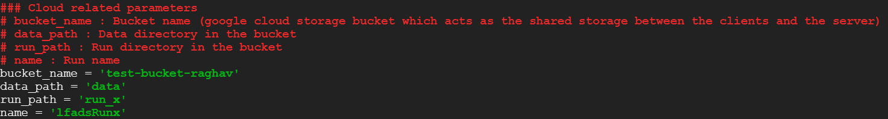

This step involves modifying the AutoLFADS python script to link to your VMs and bucket. Note that prior to this step, [cloud infrastructure](../create_infra) must be created already, the code must be [cloned inside the server VM](../add_user/#pull-autolfads-code-onto-server-vm), the user must be added to [docker group](../add_user), and the bucket must be [created](../create_bucket) and data [uploaded](../data) to it.

##Linking AutoLFADS script to your data 

First, make sure you are SSHed back into your server VM. 

<video width="100%" height="auto" controls muted autoplay loop>
  <source src="../media/browserwindowupdate.mp4" type="video/mp4">
</video>

Then, (inside the SSH window), navigate to the `autoLFADS-beta/pbt_opt` directory with the following command.

    cd autoLFADS-beta/pbt_opt

Next, we want to edit `pbt_script_multiVM.py`, the AutoLFADS run script, to link it to our data. Still inside the SSH window and inside the `autoLFADS-beta/pbt_opt` directory, open `pbt_script_multiVM.py` in a text editor of your choice. In this tutorial, we will do so in nano with the following command:

    nano pbt_script_multiVM.py

A cheat sheet on using nano is available [here](https://www.nano-editor.org/dist/latest/cheatsheet.html).

Now, you should see at the top something that looks like the following:
                                                                                                                        

First we need to set bucket_name, data_path, and run_path to point towards our bucket. 

Bucket_name refers to the name of the bucket we created, data_path to the folder where we hold our data, and run_path to the folder where our run output will be. 

Name can be set to any string we want our run to be called.

In this tutorial, we'll modify these to be the following:

<pre><code>bucket_name = 'autolfadsbucket'
</code></pre>
<pre><code>data_path = 'data'
</code></pre>
<pre><code>run_path = 'runs'
</code></pre>
<pre><code>name = 'tut_run'
</code></pre>

These changes to the script are necessary to link AutoLFADS to your data. However, there is also a variety of HPs in this script whose intial values, range of variance, and manner of pertubation by PBT can be edited.  For information on explaining the various HPs and how to edit their initial values and ranges, go to the [modifying HPs](../runAddInfo) section in the Additional Information section.

You can save your changes and exit your text editor.

