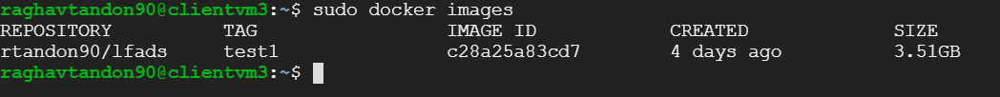

The steps in this section are essential to set-up the server and the client VMs for subsequent PBT runs. It has to be done only once - before the user tries PBT for the first time. All scripts/commands are run on the server. Make sure that all machines are started

## Get PBT code on the server machine
In the home directory of the server VM, create a dir called `PBT` and get the PBT code in it. You can do this as follows -

	mkdir ~/code
	cd ~/code
	git clone -b cloud https://github.com/mrezak/pbt_opt.git

## Add the user to the docker group

By default, the docker commands are to be prefaced with `sudo`. In order to avoid it, the user has to be added themselve to the docker group on all clients. The script for that is `add_docker_user.sh` in the `cloud_gpu_scripts` dir

This step can be performed only when the client machines are ready and docker images are downloaded (was done in the background when we created the client machines). The complete process takes about 10-15 mins to run in the background. If installations have been complete, we should be able to see the docker image as follows - 

The script to add the user to the docker group on all client machines is `add_docker_user.sh`. It is present in the path `~/code/pbt_opt/cloud_gpu_scripts` on the server. It is to be run as follows- 

	sh add_docker_user.sh <root_name> <zone>

The client virtual machines we had created earlier had the root name `clientvm` and were in the `us-central1-c` zone. To add the user in the docker group of all the client machines, the script is run as

	sh add_docker_user.sh clientvm us-central1-c

The result of this operation is that the user can run docker commands without prefixing them with `sudo`, which is the default. You can read more about this here - 

[Manage Docker as a non-root user](https://docs.docker.com/install/linux/linux-postinstall/)

After this step, we have created all infrastructure and configured it for the user